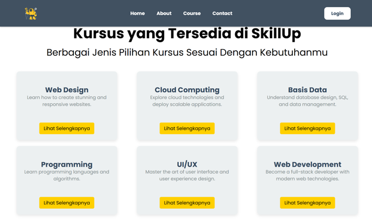
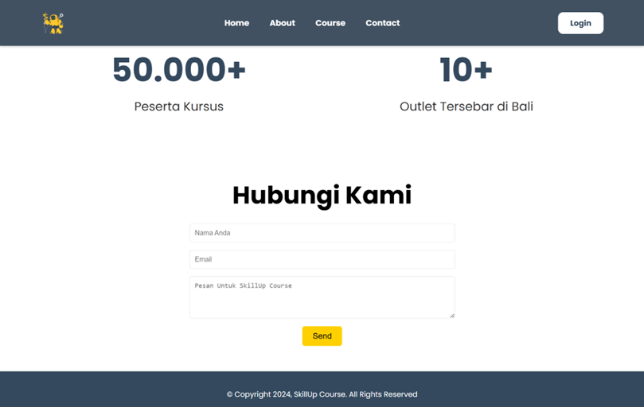
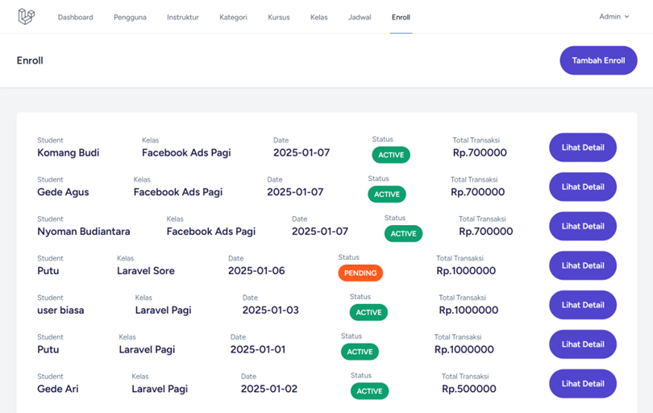
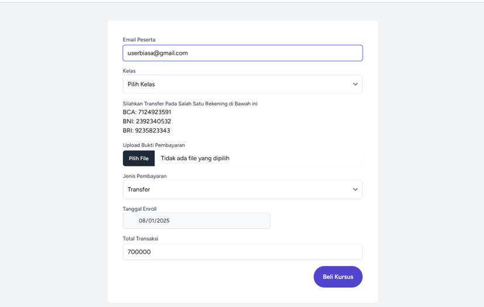
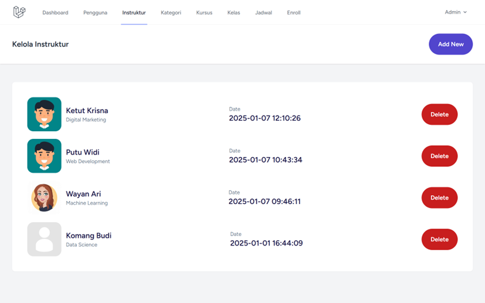
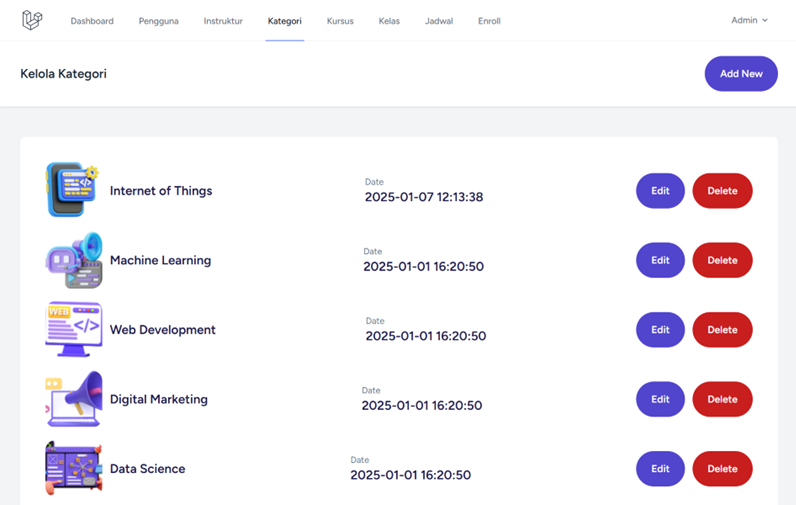
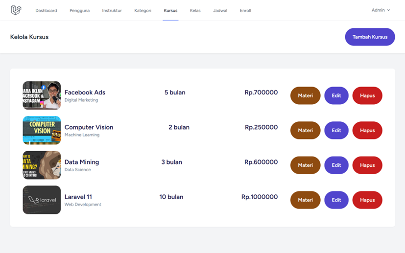
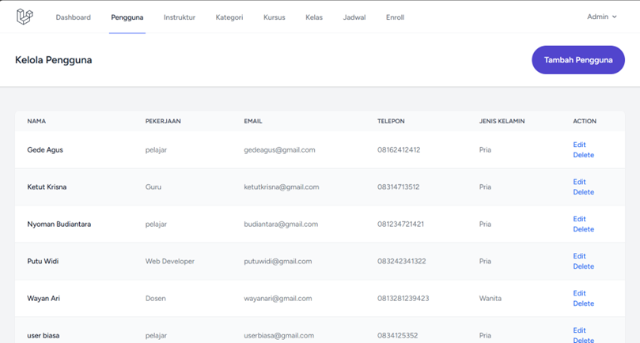
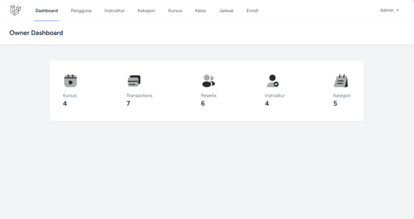

# Sistem Informasi Kursus Online

## Screenshot

| Landing Page | Landing Page 2 | Landing Page 3 |
|--------------|----------------|----------------|
|  |  |  |

| Why Us | Enroll | Form Pembayaran |
|---------------------|--------|-----------------|
|  |  |  |

| Kelola Instruktur | Kelola Kategori | Kelola Kursus |
|-------------------|-----------------|---------------|
|  |  |  |

| Kelola Pengguna | Materi Kursus | Owner Dashboard |
|-----------------|---------------|-----------------|
|  |  |  |

## Cara Instalasi

1. **Clone repository**
   ```bash
   git clone https://github.com/SatriaYudha03/Sistem-Informasi-Kursus-Online.git
   cd Sistem-Informasi-Kursus-Online
   ```

2. **Install dependencies**
   ```bash
   composer install
   ```

3. **Copy file environment**
   ```bash
   cp .env.example .env
   ```

4. **Generate application key**
   ```bash
   php artisan key:generate
   ```

5. **Konfigurasi database**  
   Edit file `.env` dan sesuaikan konfigurasi database Anda.

6. **Migrasi dan seeding database**
   ```bash
   php artisan migrate --seed
   ```

7. **Jalankan aplikasi**
   ```bash
   php artisan serve
   ```

8. **Akses aplikasi**  
   Buka browser dan akses `http://localhost:8000`

---

**Catatan:**  
Pastikan sudah menginstall PHP, Composer, dan database